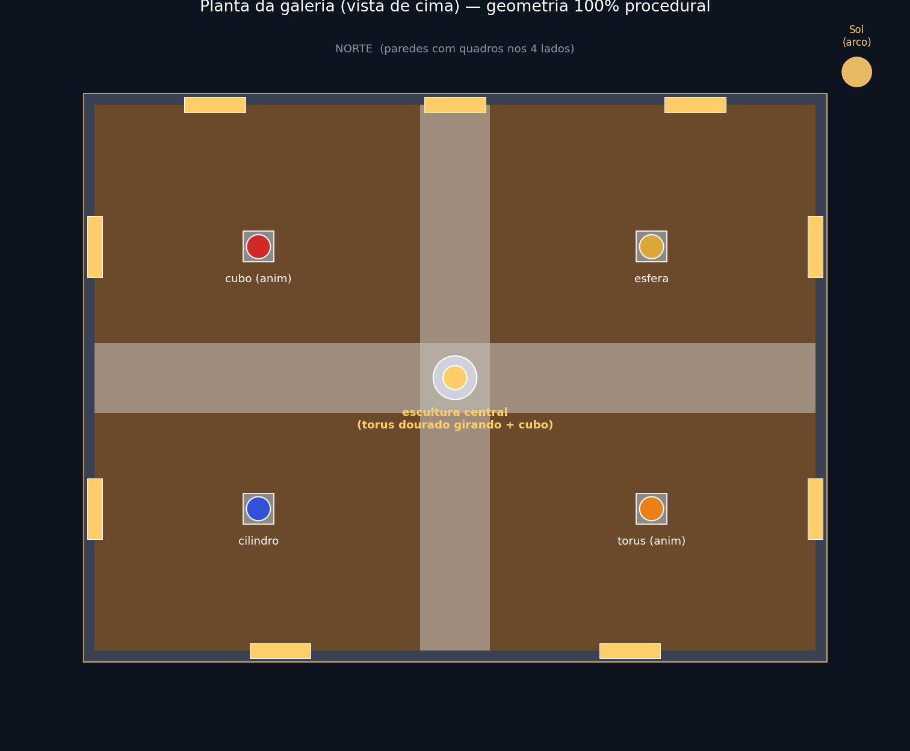
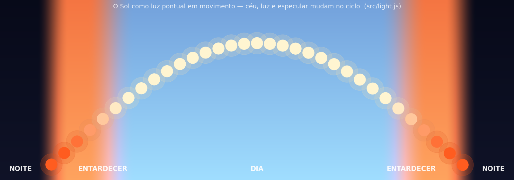
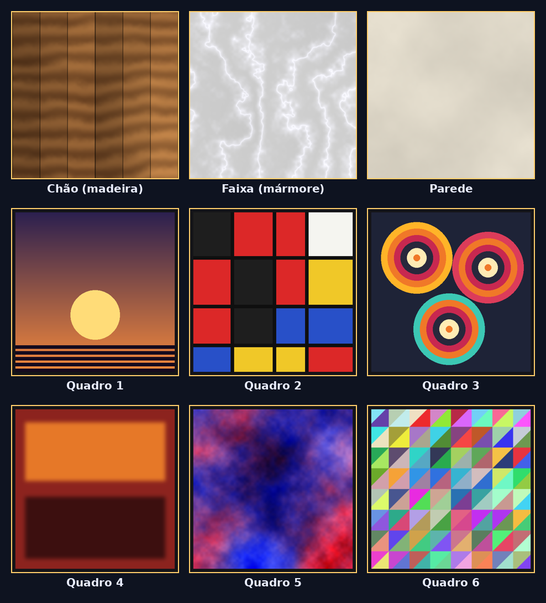

# Museu Virtual 3D — Passeio Virtual em WebGL2

Passeio virtual interativo, em **primeira pessoa**, por um **pátio/galeria de esculturas a céu aberto ao entardecer**. Tudo é renderizado com **WebGL2 puro** e shaders **GLSL ES 3.00**, sem nenhuma biblioteca gráfica de alto nível. A única dependência externa é a **gl-matrix** (álgebra linear).

O visitante caminha pelo salão (WASD + mouse), observa **quadros emoldurados texturizados** nas paredes, **esculturas geométricas** sobre pedestais de cor sólida e uma **escultura central girando**. Acima, o **Sol percorre um arco no céu** como uma luz pontual em movimento — mudando a cor da luz, do especular e do próprio céu no ciclo **dia → entardecer → noite**.

> Trabalho da disciplina de **Computação Gráfica**.
> 🔗 **Slides:** `[LINK DOS SLIDES AQUI]`
> 🔗 **Vídeo de demonstração:** `[LINK DO VÍDEO AQUI]`

---

## 🖼️ Visão geral

> As imagens abaixo são **diagramas/amostras** gerados a partir do próprio projeto. O passeio 3D em si (geometria, Phong e o Sol em movimento) é visto **rodando localmente** — veja "Como executar".

**Planta da galeria (vista de cima):** chão de madeira com faixa de mármore em cruz, paredes com 9 quadros, 4 esculturas de canto sobre pedestais e a escultura central girando.



**Ciclo do Sol (luz pontual em movimento):** o céu, a cor da luz e o especular mudam no ciclo dia → entardecer → noite (réplica fiel de `src/light.js`).



**Texturas procedurais** usadas na cena (chão, mármore, parede e os 6 quadros), todas geradas por código:



---

## ✅ Requisitos atendidos

Os 6 requisitos técnicos obrigatórios, todos funcionando:

| # | Requisito | Onde está implementado |
|---|-----------|------------------------|
| 1 | **Projeção perspectiva + câmera 1ª pessoa** | `src/camera.js` (`mat4.perspective`, `mat4.lookAt`, yaw/pitch) |
| 2 | **Iluminação Phong por fragmento com luz EM MOVIMENTO** | `shaders/phong.frag` (ambiente + difusa + especular) + `src/light.js` (Sol em arco) |
| 3 | **Objeto animado por transformação** | `src/scene.js` — torus central girando (`mat4.rotate` no tempo), + cubo, torus de canto e cubo esmeralda |
| 4 | **Objeto texturizado** | Chão de madeira, faixa/rodapé de mármore e telas dos quadros (`src/texture.js`) |
| 5 | **Objeto de cor sólida** | Pedestais, esculturas (cubo, esfera, cilindro, torus) e molduras |
| 6 | **Controle por teclado e mouse** | `src/input.js` (WASD/setas + Pointer Lock para o mouse) |

**Extras de criatividade / complexidade:** ciclo de iluminação dia→entardecer→noite com cor de céu dinâmica; Sol emissivo visível; ~9 quadros com arte gerada proceduralmente; faixa de mármore + madeira (estilo "misto"); múltiplos objetos animados; especular forte em esfera/torus dourados que acompanha o Sol; texturas 100% geradas por código.

---

## ▶️ Como executar (passo a passo)

O projeto usa **ES modules** e carrega shaders/texturas via `fetch`/`Image`. Por segurança, os navegadores **bloqueiam isso no protocolo `file://`** — então **não basta dar duplo-clique no `index.html`**. É preciso servir os arquivos por um **servidor HTTP local** (qualquer um serve).

### Opção 1 — Python (já vem no Windows/Mac/Linux)

```bash
# 1) entre na pasta do projeto
cd "Comp Grafica"

# 2) suba um servidor estático
python -m http.server 8000
#   (se "python" não funcionar, tente "py -m http.server 8000" ou "python3 -m http.server 8000")

# 3) abra no navegador
#    http://localhost:8000
```

### Opção 2 — Node.js

```bash
npx serve .
# ou
npx http-server -p 8000
```

### Opção 3 — VS Code
Instale a extensão **Live Server**, clique com o botão direito em `index.html` → **Open with Live Server**.

> **Por que precisa de servidor?** No `file://`, o navegador recusa importar módulos JS e bloqueia `fetch()` dos shaders e o carregamento das texturas (política de origem/CORS). Servindo por `http://localhost`, tudo carrega normalmente.

Use um navegador atual com **WebGL2** (Chrome, Edge, Firefox). Ao abrir, **clique na cena** para travar o mouse e começar a olhar; pressione **ESC** para liberar o cursor.

---

## 🎮 Controles

| Tecla / Ação | Função |
|---|---|
| **W** / **↑** | Andar para frente |
| **S** / **↓** | Andar para trás |
| **A** / **←** | Andar para a esquerda |
| **D** / **→** | Andar para a direita |
| **Shift** | Correr |
| **Mouse** | Olhar ao redor (após clicar na cena) |
| **ESC** | Liberar o cursor |

---

## 🗂️ Estrutura do projeto

```
.
├── index.html              # canvas + overlay (HTML/CSS) + carga do módulo principal
├── src/
│   ├── main.js             # init WebGL2, loop (requestAnimationFrame + deltaTime), render
│   ├── gl-utils.js         # compilar/linkar shaders (erros claros) + helpers
│   ├── geometry.js         # geradores: plano, quad, cubo, esfera, cilindro, torus
│   ├── mesh.js             # classe Mesh: buffers em um VAO + draw()
│   ├── camera.js           # câmera 1ª pessoa (yaw/pitch) + perspectiva
│   ├── input.js            # WASD/setas + mouse (Pointer Lock), com deltaTime
│   ├── texture.js          # loadTexture: assíncrona, placeholder 1x1, flipY, mipmaps
│   ├── light.js            # Sol: luz pontual animada em arco + ciclo do dia
│   └── scene.js            # cena orientada a dados (galeria) + update central
├── shaders/
│   ├── phong.vert          # vertex shader (GLSL 300 es)
│   └── phong.frag          # fragment shader: Phong POR FRAGMENTO
├── assets/textures/        # texturas (madeira, mármore, parede, 6 quadros)
├── libs/gl-matrix/         # gl-matrix (ESM, MIT) — única lib externa
├── slides/                 # apresentacao.pptx
├── docs/                   # diagramas (planta da cena, ciclo do Sol, texturas)
├── VIDEO_ROTEIRO.md        # roteiro do vídeo de demonstração
└── README.md
```

---

## 🛠️ Detalhes técnicos

- **Render:** WebGL2 cru. O `<canvas>` é usado **apenas** para obter o contexto `webgl2`; nenhum outro recurso de desenho de canvas 2D é usado.
- **Shaders:** GLSL `#version 300 es`. A iluminação de **Phong é calculada por fragmento** (ambiente + difusa + especular), com atenuação suave por distância (luz pontual).
- **Geometria:** 100% **procedural** (gerada em `geometry.js`); nenhum modelo 3D externo é importado.
- **Texturas:** imagens PNG geradas por código (Python/PIL). Se algum arquivo faltar, `texture.js` cria automaticamente uma textura procedural (xadrez) como _fallback_.
- **Animação:** independente da taxa de quadros (usa `deltaTime`).

---

## 📜 Créditos

- Código, geometria e texturas: **autoria própria** (geometria e imagens geradas proceduralmente).
- [**gl-matrix**](https://glmatrix.net/) — biblioteca de álgebra linear (licença MIT), incluída em `libs/gl-matrix/`. Única dependência externa permitida.
- Disciplina de **Computação Gráfica**.

---

## 🚀 Publicar no GitHub (repositório público)

O repositório Git já está iniciado com um commit inicial. Para publicar:

### Se você tem o **GitHub CLI** (`gh`) autenticado:

```bash
gh auth login                       # (apenas se ainda não estiver logado)
gh repo create museu-virtual-3d --public --source=. --remote=origin --push
```

### Manualmente (sem `gh`):

1. Crie um repositório **público** vazio em https://github.com/new (ex.: `museu-virtual-3d`), **sem** README/.gitignore.
2. Conecte e envie:

```bash
git remote add origin https://github.com/SEU_USUARIO/museu-virtual-3d.git
git branch -M main
git push -u origin main
```

> Dica: depois do push, dá para hospedar grátis em **GitHub Pages** (Settings → Pages → Branch: `main` / `root`) e ter o passeio rodando online.
